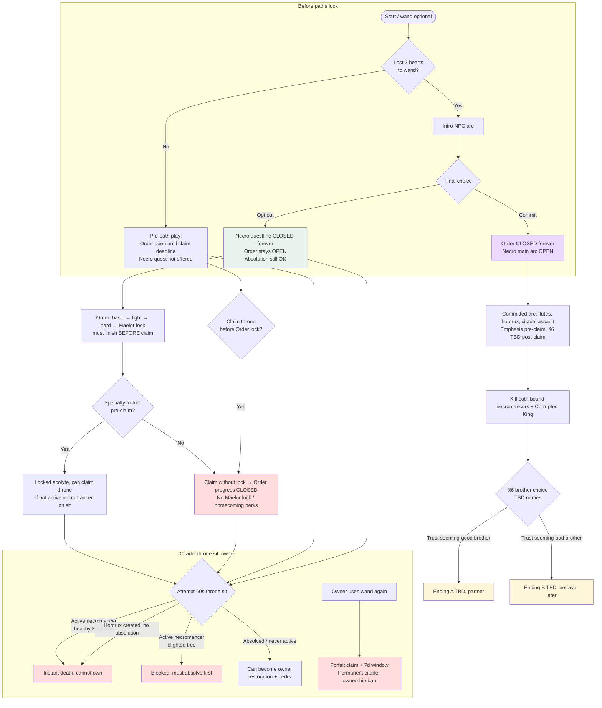

<!-- Canonical source for site/development-plan.html. Regenerate: python3 docs/marketing/build_marketing.py -->

## Mod goals {#goals}

::: want
### What we want players to feel

- **More interactive Minecraft**: better NPCs: named followers, named enemies, factions that react to you.
- **Decisions that stick**: choices that *permanently* open or close paths (Order vs committed necromancer, opt-out, no Order after citadel claim, etc.).
- **Objectives that matter**: goals that feel necessary or worth it to unlock places, gear, stations, and story, not checklist busywork for its own sake.
- **A longer game than the dragon**: meaningful **pre-dragon** and **post-dragon** arcs. The citadel seal, kingdom play, and army campaigns are part of the real timeline.
- **Vanilla still works**: never block the normal loop: build, farm, trade hall, redstone, explore your way. Mods *encourage* quests, empires, and story; they don't replace survival.
- **Two kinds of story**: **Citadel**: main lore, citadel, Order, necromancer path, relics, Minecraft tie-ins (TBD). **Armies**: your emergent kingdom *plus* authored bandit kings, named foes, loot and intel that unlocks the next threat, optional alliance with bandits, forced solo beats, emotional strife.
- **Progression that feels different**: not just better gear: titles, taxes, stations, paths, and **character stats** (see backlog).
:::

::: avoid
### What we do not want

- Minecraft feeling **broken** or "wrong" if you ignore our quests.
- Optimal play being **only** vanilla farms and trading halls, they should stay viable, but feel **less mandatory** when the mod's stories and empire loop are engaging.
- Armies becoming a spreadsheet that kills roleplay, or Citadel becoming a gate that hard-blocks creative builders.
- Copy-paste quest design, Order is **work → reward**; necromancer path is **decision → reward + weakness** (see `docs/necromancer-path.md`).
:::

## Two mods, one vision {#mods}

::: two
### Minecraft Kingdom: Armies

Villages, soldiers, taxes, horns, campaigns, bandits. Build towns and cities that **behave a bit like farms**: recurring tax and supply, while generating **your** story.

Planned: named bandit leaders, chained intel/loot, moral grey (help or hinder bandits), moments where you leave the army behind.

### Minecraft Kingdom: Citadel

Black Citadel, Corrupted King, Kingstree, Order acolyte path, necromancer path, relics, refuges. Main **Minecraft-world** story spine.

Optional with Armies; kingdom scope amplifies when both are loaded.
:::

## Solo player, permanent forks {#solo-paths}

Citadel solo design assumes **one player UUID** making irreversible calls. Multiplayer adds PvP and race-for-claim; the **locks below still apply per player**.

**Diagram:** green = still available; red = closed; gold = citadel throne / owner perks; purple = necromancer quest; blue = Order. **§6 brother endings** (partner vs betrayal) are **in discussion**: dashed in chart.

### Fork cheat sheet (canon today)

| You do this | Order acolyte path | Necromancer questline | Throne ownership |
| --- | --- | --- | --- |
| **Opt out** at intro | Open until **claim** (must **lock** pre-claim for full perks) | **Closed** | OK if **not active** necromancer on sit (`citadel-claim.md`) |
| **Commit** at intro | **Closed** | Open (§6 main arc) | **Blocked** while **active** necromancer; **blighted** tree → absolve if **no horcrux** yet |
| **Claim citadel** before Maelor lock | **Closed** for new progress | Intro may still trigger if 3 hearts; arc **pre-claim** | Owner perks if sit succeeds |
| **Locked acolyte** + absolved / non-active necro | Perks + stations after claim | Only if committed before commit lock | **Yes** |
| **Wand forfeit** as owner | - |, | **Permanent ban** from owning citadel |

**Wild cards:** horcrux pseudo-death (3 min, **no teleport**), relic ban on active necromancers, **horcrux compass** (**no range cap**, always points at nearest horcrux chunk including your own, hunter tool). Rogue sites ~**half** outpost density; **~4%** wild lich horcruxes.

## How we plan (plans to plan the plans) {#process}

::: process
Design is **author-owned**. Implementation follows written docs in `docs/`, not the other way around.

1. **Intake**: raw notes land in dated files under `docs/notes/` (not canon until merged).
2. **Section order**: `docs/notes/2026-10-05-discussion-plan.md` lists topics (lore, paths, feats, layout). We do **one section at a time**.
3. **Discuss → decide → merge**: you call the shot; we update the real doc (`acolyte-path.md`, `endgame.md`, etc.) and log the row in the discussion plan.
4. **No skip ahead** on canon until the current section is merged (unless you explicitly defer a block, e.g. lore §2–6).
5. **This section**: high-level goals and process; detail stays in markdown for implementers.

**Status snapshot (2026-10-06):** Order flow + feat gates (§8) merged. **§6 necromancer main arc** direction merged (`necromancer-path.md`). **§7** closed enough to implement: horcrux hunt loop, compass, **flute charges** (dust + blaze + ender pearl → charge; **1** play per refill for non-commit, **3** for committed necromancers), **8** End tyrants (**512–768** blocks from dragon island). **§10 citadel layout** next, mockup TBDs in `citadel-layout.md`. Lore §2–5 deferred.
:::

## Design progress (canon docs) {#progress}

::: process
### Necromancer path, items, hunt, rogues (§7)

Written to `docs/necromancer-path.md`, `docs/necromancy.md`, `docs/config-and-recipes.md`:

- Progression = **unique quest items + sacrifices** (not Order feat grids). **Flutes** = **six types**, **one per world** on **End flute tyrants**; relic indestructibility; consumed for **horcrux** rituals only.
- **Flute use:** craft **flute charge** (glowstone dust + blaze powder + ender pearl), then shapeless **flute + charge** → full bank. **Non-commit:** **1** play per refill; **committed necromancer:** **3** plays per refill. Looted flutes start **empty**.
- **Horcrux:** shard + power item (flute, god-wizard set, or king relic) + soul-list kill (**player**, **acolyte**, **End tyrant**); chest storage; environmental **ping** (owner sees it too); pseudo-death **without teleport**; destroy at **Dragon’s Well** + whitelist.
- **Rogues:** ~**half** pillager-outpost density; sites = cave crypt / surface crypt / dark tower / **taken village** (villagers **board up** in houses); **~4%** wild lich horcrux; shards from all rogues.
- **Horcrux compass:** shapeless, compass, phylactery shard, soul sand, wither rose; **unlimited range**; **never** hides your horcruxes; points to **nearest horcrux chunk** (noisy after map exploration).
- **End tyrants:** **8** bosses on **outer End** (not dragon island), **512–768** blocks from island center; **6** drop flutes and use them in fight (**60s** boss cooldown).
- **Beast Dirge:** 50% of eligible animals in loaded chunks take 4–12 hearts blight; flutes never hurt the player.

### Necromancer path, story (§6, in discussion)

Outline in `necromancer-path.md` **Main quest arc**: intro → mentor → citadel climax → **misleading brother choice** → branch endings (mega End portal ending **TBD** vs post-claim citadel).

### Black Citadel, layout & assault (§10, paused)

Written to `docs/citadel-layout.md` and `docs/citadel-defenders.md`, siege ladder **20** blocks; defensive mode, spawners, traps. Remaining TBDs wait on Creative mockup debrief.
:::

## Design backlog (from goals, not all implemented) {#backlog}

::: planned
Items called out in goal-setting that still need specs in `docs/` and then code:

| Item | Mod | Intent |
| --- | --- | --- |
| **Permanent max-health boost** when Maelor locks Order specialty | Citadel | Progression reward for acolyte commit; tune in config. |
| **Larger permanent max-HP boost** for locked **War Leader** acolyte | Citadel (Order) | Bigger than other three specialties; amount TBD config. |
| **War Leader acolyte: no damage to own troops unless sneaking** | Citadel (Order) | See callout below, locked War Leader specialty only. |
| Named bandit kings, loot/intel chains, optional bandit alliance, solo-forced quests | Armies (+ Citadel hooks) | Army-side storylines; less "main lore" than citadel, still authored. |
| Tax / claim loop as soft "farm" replacement | Armies | Empire income without requiring vanilla iron farms for fun. |
| **§6** intro NPC, mentor, citadel access beats, brother endings | Citadel | Player-facing main necromancer arc. |
| **End flute tyrant** camps (8 placements, island template) | Citadel | Six flutes + two shard-only bosses; book clues **TBD**. |
| Per-flute **player cooldown** after play | Citadel | Tune in playtest. |
| `necromancerRogueSiteSpacing` playtest value | Citadel | ~400–512 blocks initial target. |
:::

::: planned
### War Leader acolyte, friendly-fire rule (design intent)

A player whose Order specialty is **locked as War Leader** (`acolyte-path.md`) **cannot hurt their own soldiers or militia** with direct player damage (melee, arrows, tridents, etc.) while **not sneaking**.

- **Default:** hits against *your* soldiers/militia do not apply (cancelled or no damage).
- **Sneaking:** you *can* damage your own troops, intentional only (discipline, mutiny edge cases per Armies rules).
- **Other specialties** (Arcane, Alchemist, Smith) follow normal Armies friendly-fire rules.
- **Not** kingdom NPC "Warlords" raids or a separate kingdom title, Order War Leader only.
- Explosions, lava, and fire may still harm troops unless we add exceptions later (TBD).
:::

## Mod compatibility targets {#compat}

::: process
**Not dependencies.** Armies and Citadel must run on their own. When other mods are in the pack we aim for two levels:

- **Coexist**: verify claims, quests, spawns, death/loot, and UI don't fight each other (smoke-test per release).
- **Extend**: optional integration that wakes **dormant** content in our mobs, quests, or abilities only when that mod is loaded (no crash if absent).

Pack makers pin versions we test against; nothing here is required to play.
:::

Priority list (initial, expand in `docs/integration.md` when specced):

| Mod | Kind | Intent |
| --- | --- | --- |
| [Small Ships](https://modrinth.com/mod/small-ships) | Coexist + extend | Naval campaigns; future soldier crew aboard ship entities (not vanilla boats). |
| [Ice and Fire: Community Edition](https://www.curseforge.com/minecraft/mc-mods/ice-and-fire-community-edition) | Coexist + extend | Mythic mobs and dragons alongside citadel lore; parallel fantasy, not a hard gate. |
| [Mowzie's Mobs](https://www.curseforge.com/minecraft/mc-mods/mowzies-mobs) | Extend | Selected bosses/mobs feed quests or unlock abilities in our content when present. |
| [Alex's Mobs](https://www.curseforge.com/minecraft/mc-mods/alexs-mobs) | Extend | Same pattern, optional encounter/quest hooks, not replacements for our roster. |
| [Corpse](https://modrinth.com/mod/corpse) | Coexist | Death body / loot recovery compatible with army wipes and citadel defeats. |
| [Comforts](https://modrinth.com/mod/comforts) | Coexist | Sleeping bags/hammocks don't break campaign pacing or claim rules. |
| [Grappling Hooks](https://modrinth.com/mod/grappling-hooks) | Coexist | Traversal during citadel exploration and siege prep. |
| World map mod (**TBD**) | Coexist | Waypoints/markers for refuges, claims, citadel, **confirm Xaero's vs JourneyMap** with author. |
| [Biomes O' Plenty](https://modrinth.com/mod/biomes-o-plenty) | Coexist | Extra biomes for worldgen; quest placement and structures must still find valid terrain. |
| [Create](https://modrinth.com/mod/create) | Coexist | Village protection vs moving contraptions; factory bases beside claims. |
| [Epic Knights: Shields, Armor and Weapons](https://modrinth.com/mod/epic-knights-shields-armor-and-weapons) | Coexist + gear | Soldier kits and supply accept modded medieval gear. |
| [Medieval Siege Machines](https://modrinth.com/mod/medieval-siege-machines) | Coexist + extend (planned) | Player siege complements walls; soldier-operated siege is integration target, not day-one AI. |

### Canonical doc index (implementers)

- `docs/overview.md`, scope and build order
- `docs/acolyte-path.md`, Order quest + feats
- `docs/necromancer-path.md`, dark path philosophy, §6 arc, §7 items
- `docs/endgame.md`, `docs/citadel-claim.md`, `docs/citadel-layout.md`, `docs/citadel-defenders.md`, citadel loop & siege
- `docs/necromancy.md`, wand, rogues, horcrux design
- `docs/soldiers-and-villages.md`, `docs/war-and-defense.md`, Armies
- `docs/notes/2026-10-05-discussion-plan.md`, section queue + decision log
